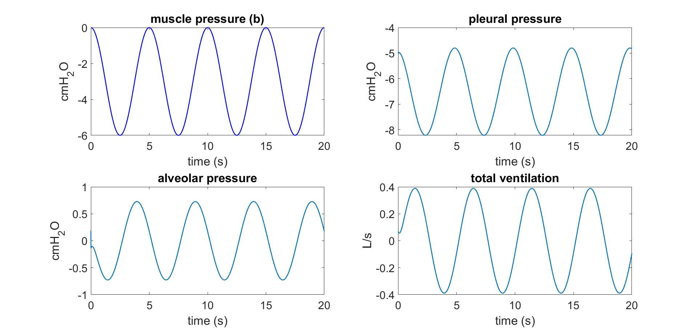
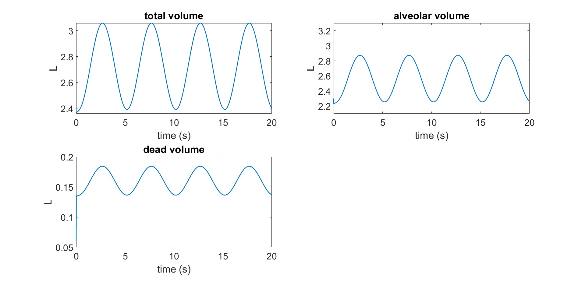

# Project 06

## Title
Lumped-Parameter Respiratory Mechanics Simulation Under Spontaneous Breathing

## Executive Summary
This project simulates respiratory system dynamics using a multi-compartment lumped model driven by periodic muscle pressure. The model reproduces realistic cyclic behavior of pleural and alveolar pressures, ventilation flow, and lung volumes over a 20-second interval. Results show stable periodic breathing with a 5-second cycle and coherent coupling between pressure generation, airflow, and compartment volumes.

## Model Description
The script defines a compartmental respiratory network with compliances and resistances:

- Compliances: `Cl`, `Ct`, `Cb`, `CA`, `Ccw`
- Resistances: `Rml`, `Rlt`, `Rtb`, `RbA`
- Unstressed volumes: `Vul`, `Vut`, `Vub`, `VuA`

State pressures are updated by Euler integration:

- `P1` (laryngeal/lung proximal node)
- `P2` (thoracic compartment node)
- `P3` (bronchial node)
- `P4` (alveolar elastic node)
- `P5` (chest wall node)

Derived variables include:

- Pleural pressure: `Ppl = P5 + Pmus`
- Alveolar pressure: `PA = P4 + Ppl`
- Total ventilation flow: `dV = (Pa0 - Pl)/Rml`
- Alveolar ventilation flow: `dVA = (Pb - PA)/RbA`
- Volumes: `Vl`, `Vt`, `Vb`, `VA`, and dead volume `VD = Vl + Vt + Vb`

## Input and Simulation Settings
- Muscle pressure input:
  - `Pmus(t) = Amus*cos(2*pi*t/T) - Amus`
  - `Amus = 3 cmH2O`, `T = 5 s`
- Airway pressure reference: `Pa0 = 0 cmH2O`
- Time step: `dt = 0.0002 s`
- Duration: `0-20 s`

The breathing frequency implied by `T = 5 s` is:

- `f = 60/T = 12 breaths/min`

## Results

### 1. Pressures and Ventilation Flow

The model generates stable periodic cycles for all plotted variables:

- `Pmus` oscillates from approximately `0` to `-6 cmH2O`.
- `Ppl` oscillates around a negative baseline (about `-8` to `-5 cmH2O`).
- `PA` oscillates near zero with moderate amplitude (roughly `-0.7` to `+0.7 cmH2O`).
- Total ventilation flow oscillates approximately between `-0.4` and `+0.4 L/s`.

The phase relationships are physiologically consistent: muscle pressure drive changes pleural pressure, which modulates alveolar pressure and produces inspiratory/expiratory flow reversals.

### 2. Volumetric Dynamics

- Total lung system volume (`VA + VD`) oscillates approximately between `2.4` and `3.05 L`.
- Alveolar volume (`VA`) oscillates approximately between `2.25` and `2.88 L`.
- Dead volume (`VD`) oscillates with smaller amplitude around roughly `0.14-0.18 L`.

All signals converge rapidly to a periodic steady pattern after a short initial transient.

## Ventilation Metrics
The script computes:

- `Alveolar_Vent = (max(VA) - min(VA))*60/T`
- `Minute_Vent = (max(VA+VD) - min(VA+VD))*60/T`

From the plotted amplitudes, approximate values are:

- Alveolar ventilation: about `7.5-8.0 L/min`
- Minute ventilation: about `8.0-8.5 L/min`

(Exact values are printed by MATLAB when running the script.)

## Discussion
The simulation behavior is internally consistent for a forced periodic breathing model. Negative muscle pressure lowers pleural pressure, creating pressure gradients that drive airflow and cyclic changes in alveolar and dead-space volumes.

The model also captures a realistic hierarchy of amplitudes: alveolar and total volume changes are larger than dead-space oscillations, while alveolar pressure remains comparatively small around atmospheric reference. This matches the expected mechanical buffering effect of respiratory compliance.

Overall, project 06 provides a coherent dynamic representation of spontaneous ventilation mechanics and yields plausible ventilation magnitudes for the chosen parameter set.

## Conclusion
project 06 successfully reproduces periodic respiratory mechanics in a compartmental lung-chest model.

Main outcomes:

1. Stable periodic pressure and flow oscillations at `12 breaths/min`.
2. Physiologically coherent coupling between pleural pressure, alveolar pressure, airflow, and compartment volumes.
3. Reasonable estimated alveolar and minute ventilation values from simulated volume excursions.

The model is suitable as a baseline for future investigations involving altered resistance, compliance, or respiratory muscle drive.

