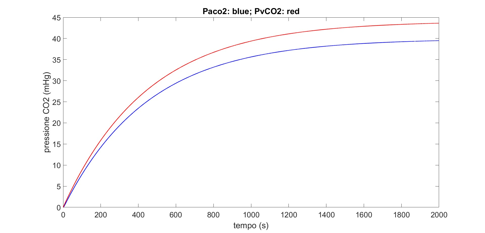
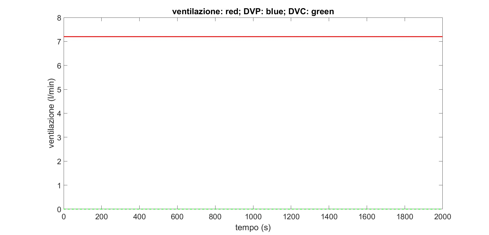
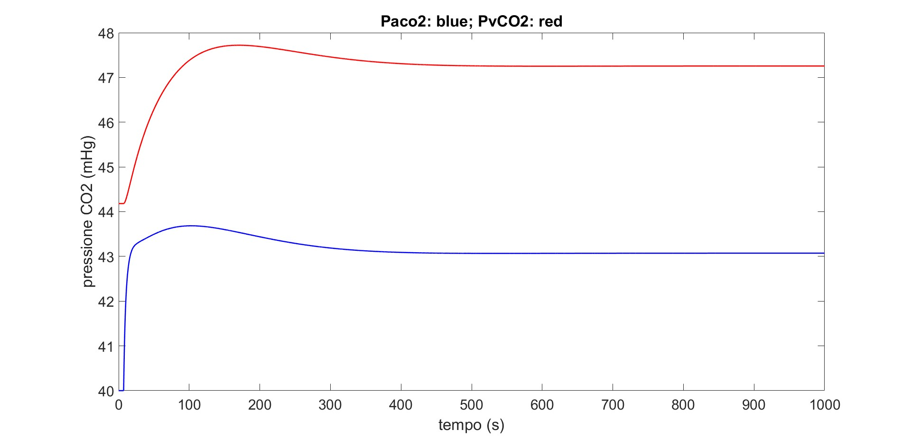
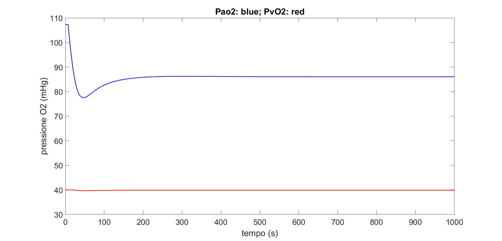
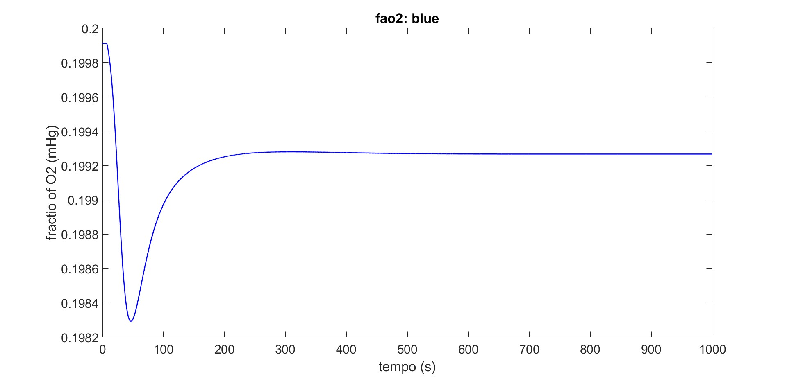
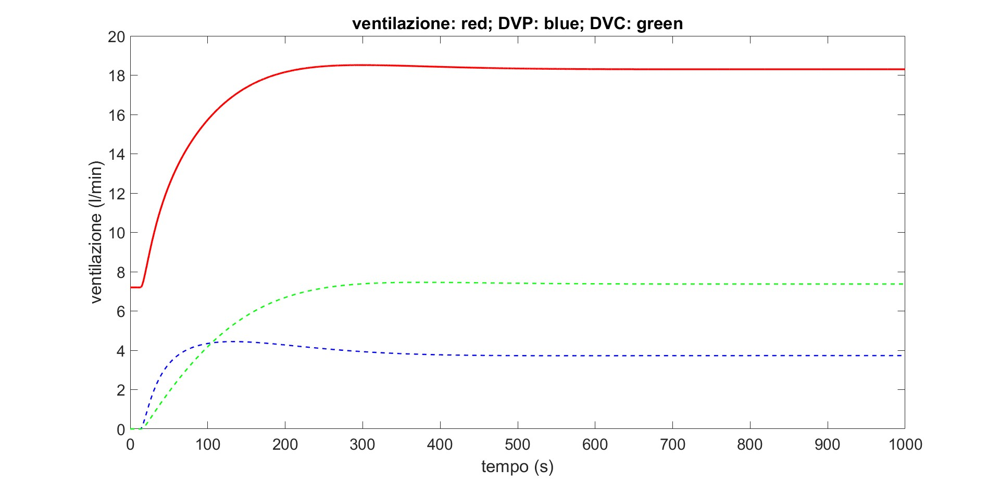

# Module 08

## Title
Integrated CO2/O2 Gas Exchange and Ventilatory Control: Baseline and Chemoreflex-Active Simulations

## Executive Summary
module 08 contains two related simulations. Part I (`gas_exchange_part1_co2.m`) models CO2 dynamics with ventilation decomposition but with control gains set to zero. Part II (`gas_exchange_part2_co2_o2_control.m`) extends the model to include O2 dynamics and active chemoreflex gains for both central and peripheral components.

Part I converges to a constant-ventilation state with CO2 rising to a new equilibrium. Part II shows coupled CO2/O2 regulation with increased total ventilation and a nonzero split between peripheral and central drive contributions.

## Model Structure
The model includes alveolar and tissue compartments with gas transport and ventilatory control terms.

Main variables:

- `Paco2`, `Pvco2`: alveolar and venous CO2 pressure
- `Pao2`, `Pvo2`: alveolar and venous O2 pressure (Part II)
- `V`: effective ventilation command (L/s)
- `DVp`, `DVc`: peripheral and central ventilatory contributions

Key transport equations (conceptual form):

- `dPaco2/dt = ((V-VD)*(PIco2-Paco2) + 863*Q*Kco2*(Pvco2-Paco2))/Vlung`
- `dPvco2/dt = (Q*Kco2*(Paco2-Pvco2) + Mco2)/(Vtiss*alphaco2)`
- `dPao2/dt = ((V-VD)*(PIo2-Pao2) + 863*Q*(fvo2-fao2))/Vlung` (Part II)
- `dPvo2/dt = (Q*(fao2-fvo2) + Mo2)/(Vtiss*alphao2)` (Part II)

with sigmoid oxygen content relations:

- `fao2 = 0.2/(1+exp(-ko2*(Pao2-Phalf)))`
- `fvo2 = 0.2/(1+exp(-ko2*(Pvo2-Phalf)))`

Ventilation command:

- `V = V0 + DVp + DVc`

## Part I: CO2 Model Without Active Gain (`gas_exchange_part1_co2.m`)

### Setup
- Duration: `2000 s`
- `dt = 0.1 s`
- `Fattore_guadagno = 0` so `Gp = 0`, `Gc = 0`
- `DVp` and `DVc` stay at zero, thus `V = V0 = 0.12 L/s` (`7.2 L/min`)

### Results
#### CO2 pressures

`Paco2` (blue) and `Pvco2` (red) rise monotonically from initial near-zero values and asymptotically approach a steady state around `~39.5 mmHg` (alveolar) and `~43.8 mmHg` (venous).

#### Ventilation components

Ventilation remains constant at approximately `7.2 L/min` while `DVp` and `DVc` remain zero, matching gain settings.

## Part II: CO2+O2 Model With Active Gains (`gas_exchange_part2_co2_o2_control.m`)

### Setup
- Duration: `1000 s`
- `dt = 0.1 s`
- Active gains: `Gpc > 0`, `Gpo > 0`, `Gc > 0`
- Includes delayed peripheral and central control terms and O2 feedback component

### Results
#### CO2 pressures

`Paco2` settles near `~43.1 mmHg`, while `Pvco2` settles higher around `~47.2-47.3 mmHg`, after a transient overshoot in venous CO2.

#### O2 pressures

`Pao2` drops from initial high value and stabilizes around `~86 mmHg`; `Pvo2` remains close to `~40 mmHg`.

#### Alveolar O2 fraction

`fao2` changes only slightly (around 0.199) and converges smoothly after an early dip.

#### Ventilation decomposition

Total ventilation (red) rises from baseline to about `~18.3 L/min`. Peripheral component `DVp` (blue, dashed) and central component `DVc` (green, dashed) both contribute, with `DVc` becoming the dominant term at steady state.

## Discussion
The two parts illustrate the effect of activating ventilatory feedback loops. In Part I, the system behaves as an open-loop gas exchange model with fixed ventilation, so gases converge passively to equilibrium. In Part II, added chemoreflex terms actively modulate ventilation and change the final gas pressures.

The large increase in total ventilation in Part II is consistent with positive controller gains and delayed responses to CO2/O2 signals. The central contribution eventually exceeds peripheral contribution, which aligns with slower but stronger long-term control action.

Overall, the simulations are coherent and useful for understanding how transport dynamics and control gains jointly shape blood-gas regulation.

## Conclusion
module 08 successfully demonstrates baseline and feedback-regulated gas exchange behavior.

Main outcomes:

1. Part I: fixed ventilation produces passive CO2 convergence with zero controller contributions.
2. Part II: active control substantially increases ventilation and reshapes CO2/O2 steady states.
3. Peripheral and central components contribute differently over time, with central drive dominating steady state.

These results provide a strong foundation for gain tuning and sensitivity analyses in ventilatory control modeling.

