# Project 09
## Title
Chaotic Dynamics Analysis of Lorenz and Rossler Systems

## Executive Summary
This project investigates nonlinear chaotic dynamics using two classical systems: Lorenz (`lorenz_chaos.m`) and Rossler (`rossler_chaos.m`). For both models, phase portraits and 3D attractors are analyzed, and sensitivity to initial conditions is tested by running two trajectories with nearly identical initial states.

The Lorenz simulation with `rho = 23.8` exhibits chaotic-like switching between two lobes with visible trajectory divergence. The Rossler simulation with `a = 0.45`, `b = 2`, `c = 4` shows broadband irregular oscillations and strong sensitivity, with additional parameter-sweep panels illustrating qualitative changes near nearby `a` values.

## Methods and Setup
### 1. Lorenz System (`lorenz_chaos.m`)
Parameters:

- `sigma = 10`
- `beta = 8/3`
- `rho = 23.8`
- Initial condition: `X0 = [1, 1, 1]`
- Time span: `0 to 200 s`

Dynamics (standard Lorenz form):

- `dx/dt = sigma*(y - x)`
- `dy/dt = x*(rho - z) - y`
- `dz/dt = x*y - beta*z`

Sensitivity test:

- Perturbed initial condition: `X0(1) + 1e-15`

### 2. Rossler System (`rossler_chaos.m`)
Parameters:

- `a = 0.45`
- `b = 2`
- `c = 4`
- Initial condition: `X0 = [1, 1, 1]`
- Time span: `0 to 2000 s`

Dynamics (Rossler form):

- `dx/dt = -y - z`
- `dy/dt = x + a*y`
- `dz/dt = b + z*(x - c)`

Sensitivity test:

- Perturbed initial condition: `X0(1) + 1e-12`

Parameter sweep:

- `a` varied in `[0.37, 0.397]` (9 subcases)
- Each case plotted in `x2-x3` phase space

## Results

## A. Lorenz Results
### A1. 3D attractor
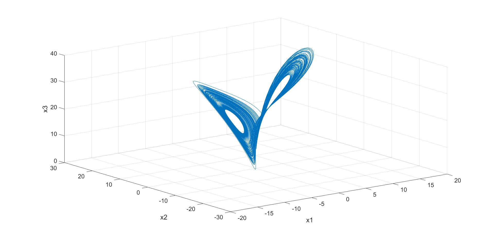

The trajectory forms the classical two-lobe Lorenz attractor, with irregular lobe switching and bounded chaotic motion.

### A2. 2D phase portraits
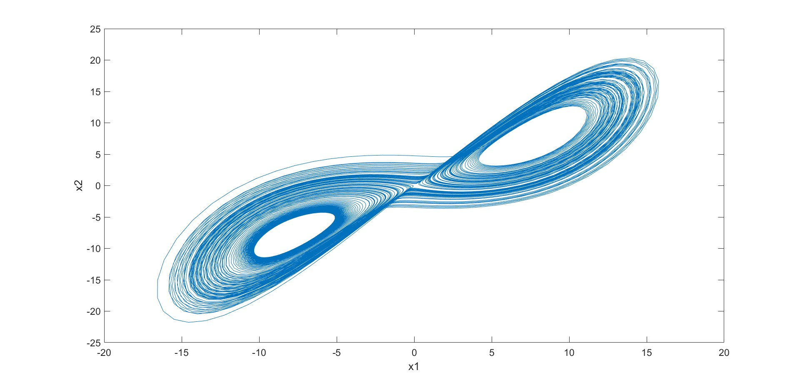
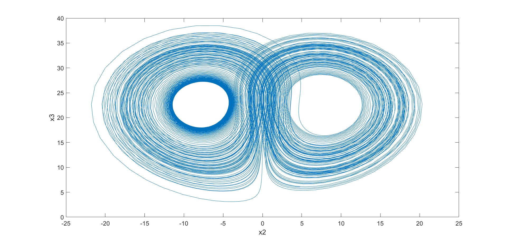
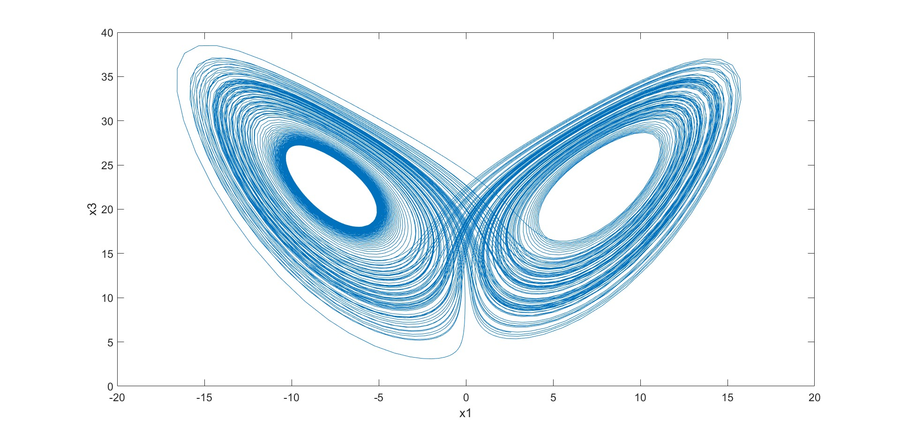

Phase-plane projections preserve the characteristic butterfly geometry and reveal non-periodic orbit layering.

### A3. Sensitivity to initial conditions
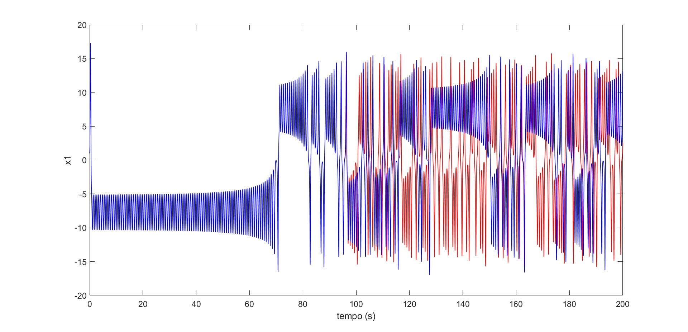
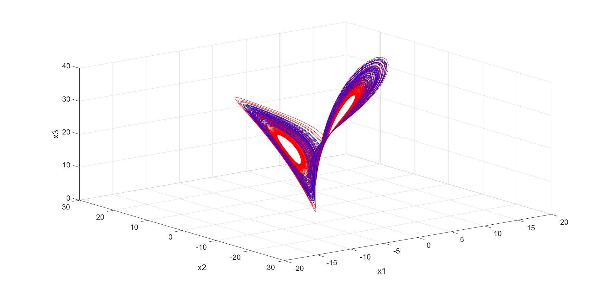

Two trajectories with tiny initial perturbation initially overlap, then diverge strongly in time and phase space, consistent with sensitive dependence on initial conditions.

## B. Rossler Results
### B1. 3D attractor
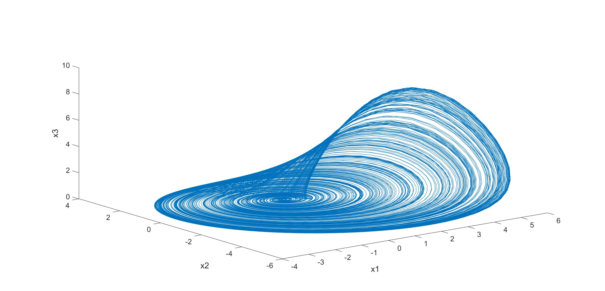

The attractor shows a spiral-sheet structure with repeated expansion and folding.

### B2. 2D phase portraits
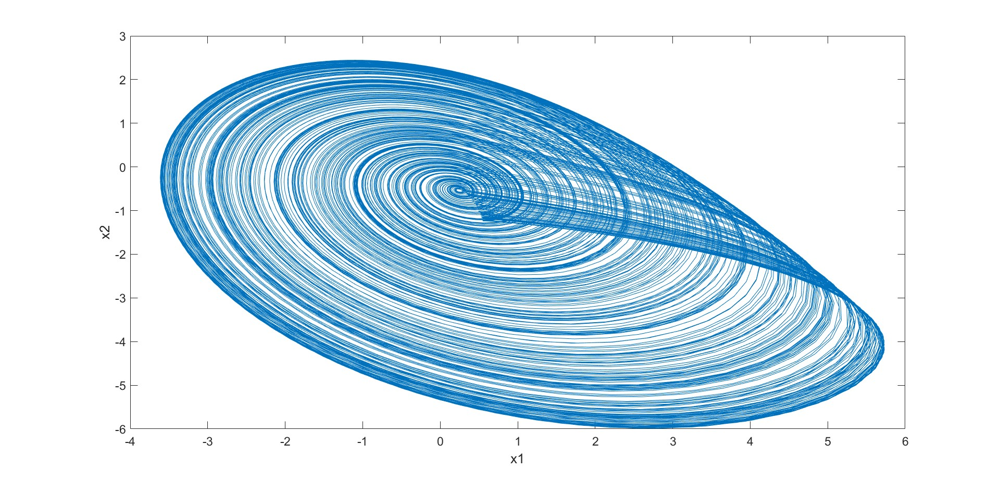
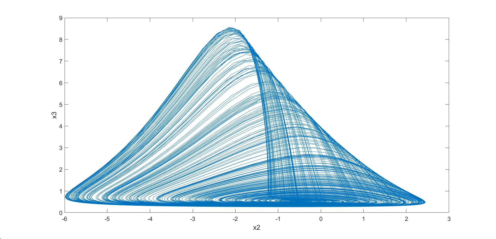
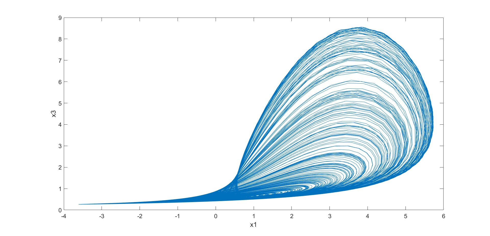

Projections show broad loops with variable return paths, supporting aperiodic behavior.

### B3. Sensitivity and parameter sweep
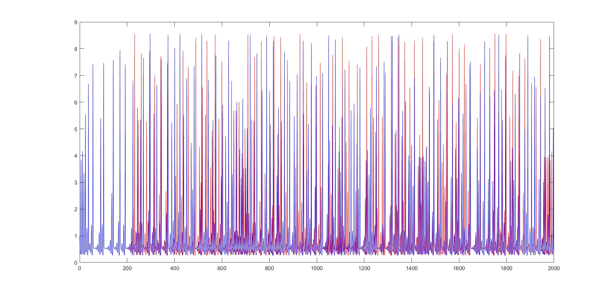

The perturbed and unperturbed trajectories decorrelate over long horizon, showing chaotic sensitivity.

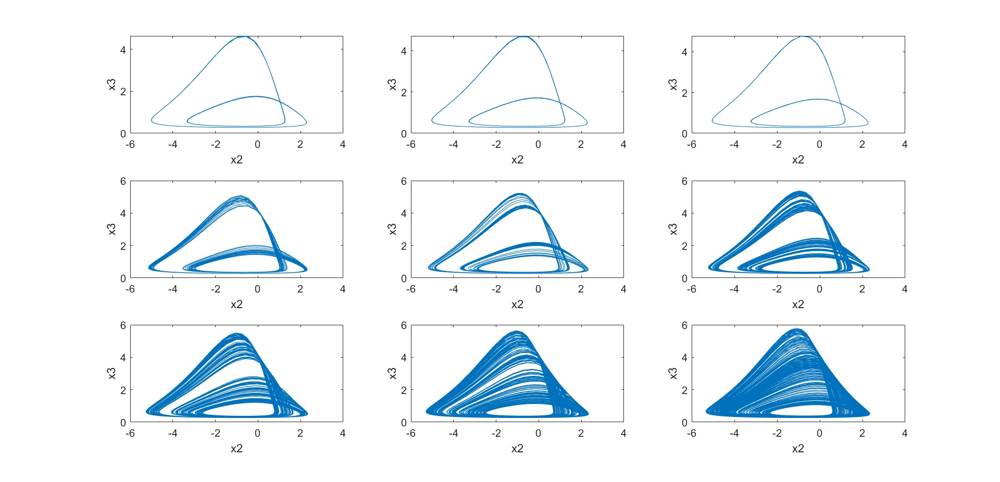

The 3x3 panel (`x2-x3`) across nearby `a` values highlights strong shape changes in oscillation geometry, indicating high qualitative sensitivity to parameter variation near the explored range.

## Discussion
Both systems display hallmark properties of deterministic chaos: bounded attractors, non-repeating trajectories, and strong sensitivity to tiny initial-condition perturbations.

The Lorenz case exhibits lobe-switching behavior with clear divergence between near-identical runs, while the Rossler case emphasizes spiral chaotic motion and pronounced parameter dependence in the local sweep. Together, these outcomes illustrate how simple low-dimensional nonlinear ODEs can generate complex long-term behavior.

## Conclusion
project 09 successfully demonstrates chaotic dynamics in two classical models.

Main outcomes:

1. Lorenz and Rossler simulations generate bounded strange-attractor-like trajectories.
2. Extremely small initial perturbations produce large long-term trajectory differences.
3. Nearby parameter values (Rossler `a` sweep) produce visible qualitative changes in phase geometry.

These results provide a strong basis for further analyses such as Lyapunov estimation, bifurcation tracking, and control/synchronization studies in nonlinear dynamical systems.

