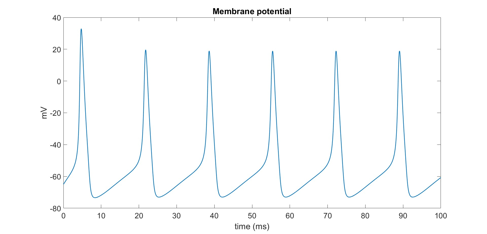

# Biological System Modeling

MATLAB-based simulations of physiological and dynamical systems, covering membrane models, circulation, respiratory control, gas exchange, hemodialysis, and nonlinear neural dynamics.

## Overview

This repository collects 10 modeling projects focused on mathematical and computational analysis of biological systems. Each project includes:

- a MATLAB script for simulation
- a short report summarizing the model and results
- exported figures for visual interpretation

## Project Topics

| Project | Topic | Main Focus |
|---|---|---|
| `01_membrane_model` | First-order membrane model | Analytical vs numerical simulation of membrane voltage |
| `02_circulation_no_control` | Circulation without control | Hemorrhage response in systemic circulation |
| `03_circulation_methods_comparison` | Circulation method comparison | Euler, eigenvalue, and matrix-exponential solutions |
| `04_circulation_feedback_control` | Circulation with feedback control | Pressure and flow recovery during hemorrhage |
| `05_hemodialysis_dynamics` | Hemodialysis dynamics | Solute, volume, and osmolarity changes over time |
| `06_respiratory_spontaneous_breathing` | Respiratory mechanics | Spontaneous breathing dynamics |
| `07_respiratory_assisted_controlled` | Assisted and controlled ventilation | Pressure, flow, and volume behavior under ventilation |
| `08_gas_exchange_ventilation_control` | Gas exchange and ventilatory control | CO2/O2 regulation with feedback |
| `09_nonlinear_dynamics_chaos` | Nonlinear dynamics and chaos | Lorenz and Rossler attractors and sensitivity |
| `10_hodgkin_huxley_neuron` | Hodgkin-Huxley neuron | Repetitive spiking and ionic conductance dynamics |

## Selected Figures

<p align="center">
  
  
  
</p>

<p align="center">
  Representative outputs from the neuron, chaos, and gas-exchange models.
</p>

## Repository Structure

```text
biological-system-modeling/
|-- 01_membrane_model/
|-- 02_circulation_no_control/
|-- 03_circulation_methods_comparison/
|-- 04_circulation_feedback_control/
|-- 05_hemodialysis_dynamics/
|-- 06_respiratory_spontaneous_breathing/
|-- 07_respiratory_assisted_controlled/
|-- 08_gas_exchange_ventilation_control/
|-- 09_nonlinear_dynamics_chaos/
|-- 10_hodgkin_huxley_neuron/
`-- README.md
```

## How to Use

Open any project folder in MATLAB and run the main `.m` script. Most folders also contain:

- `Report.md` with a short explanation of the model and results
- `figures/` with exported plots generated from the simulations

## Notes

- The repository is organized as a set of independent modeling exercises rather than a single software package.
- Topics combine physiological modeling, control systems, numerical methods, and nonlinear dynamics.

## License

No license file is currently included in this repository. If you plan to share or reuse the work publicly, adding a license is recommended.
