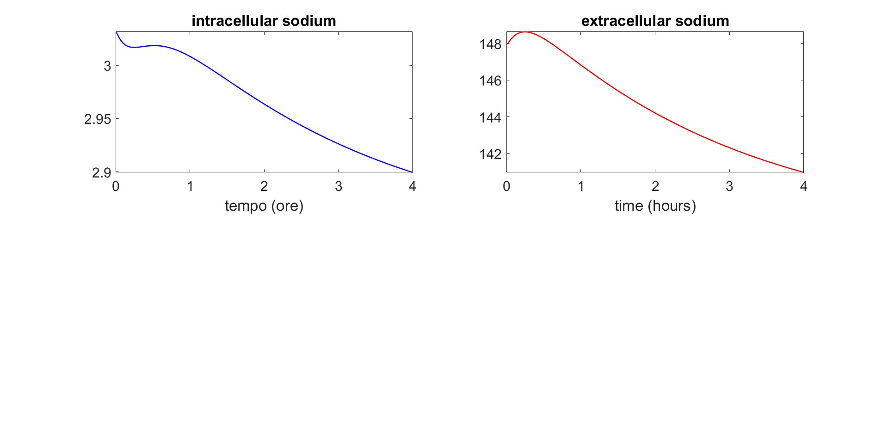
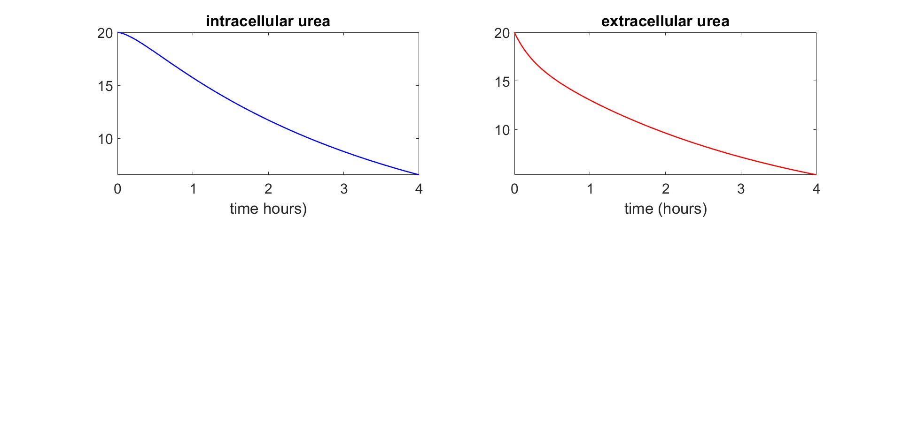
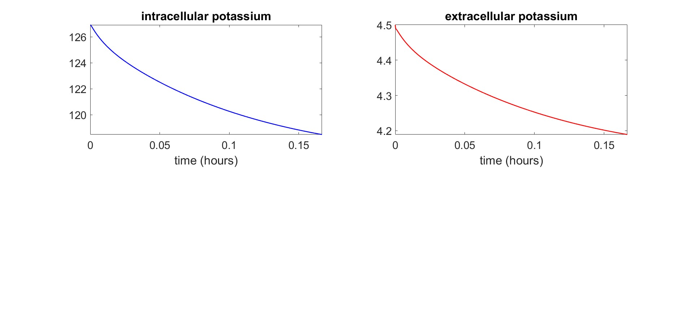
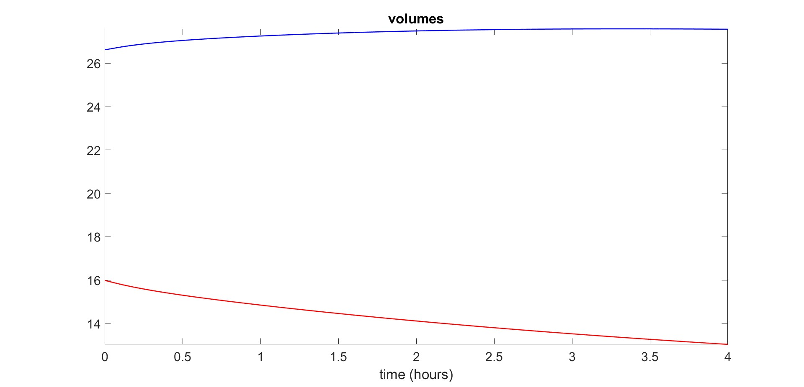
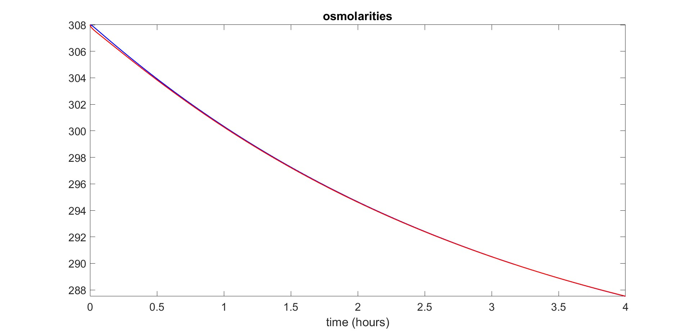
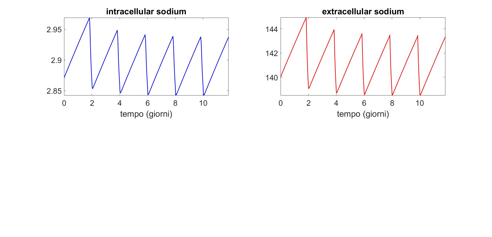
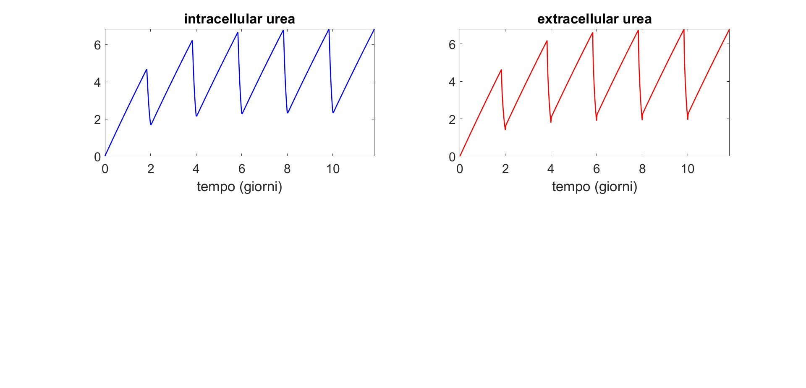
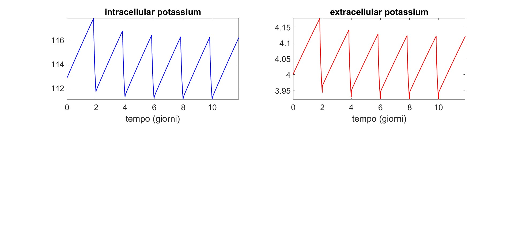
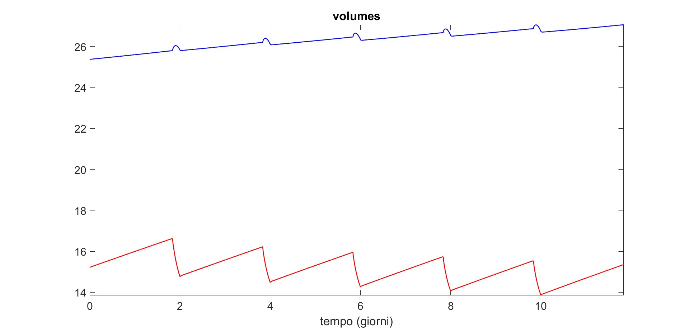
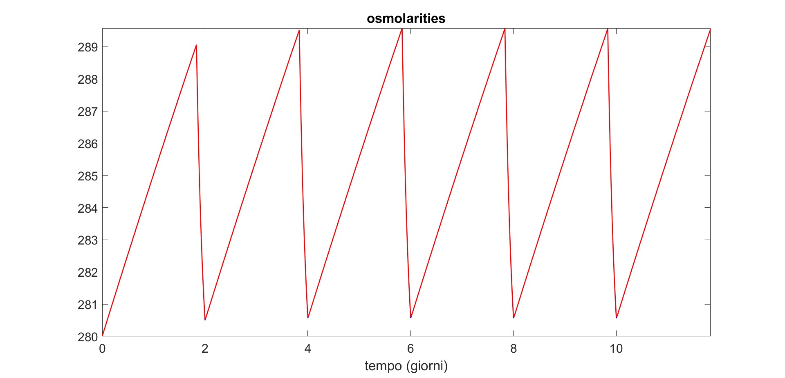

# Exercise 05

## Title
Two-Compartment Solute and Fluid Dynamics During Hemodialysis: Single Session and Repeated Sessions

## Executive Summary
This exercise studies sodium, urea, potassium, fluid volumes, and osmolarity in a two-compartment model (intracellular and extracellular spaces) under dialysis. Two simulation settings are analyzed: a single 4-hour session (`Exercise5.m`) and repeated intermittent sessions over multiple days (`Exercise5_II.m`).

The single-session model shows smooth solute reduction, extracellular volume removal, and osmolarity decrease. The repeated-session model shows expected sawtooth dynamics: concentrations and osmolarity rise between treatments and are reduced during each dialysis window.

## Model Formulation
State variables are intracellular/extracellular masses (`Mi_x`, `Me_x`) and volumes (`Vi`, `Ve`) for solutes `x in {Na, U, K}`.

Main relations used in both scripts:

- `ci_x = Mi_x / Vi`
- `ce_x = Me_x / Ve`
- `dVi/dt = kf*(osmi - osme)`
- `dVe/dt = Ii - qf - kf*(osmi - osme)`

For each solute `x`:

- `dMi_x/dt = -ki_x*(Mi_x/Vi) + ke_x*(Me_x/Ve) + u_x`
- `dMe_x/dt = ki_x*(Mi_x/Vi) - ke_x*(Me_x/Ve) - d*(Me_x/Ve - cxd) - qf*ce_x`

Osmolarities are computed as:

- `osmi = 0.93*(ci_Na + ci_K + ci_U + ceqi)`
- `osme = 0.93*(ce_Na + ce_K + ce_U + ceqe)`

## Scenario A: Single 4-Hour Session (`Exercise5.m`)

### Setup
- Simulation duration: `4 h`
- Time step: `dt = 0.1 min`
- Dialysis and ultrafiltration are active continuously during the session (`d = 0.241`, `qf = 2/240`)
- No intake during dialysis (`Ii = 0`)

### Results
#### Sodium

Intracellular sodium decreases slightly, while extracellular sodium decreases more clearly (roughly from 148 to ~141 mmol/L), consistent with dialytic clearance.

#### Urea

Both intracellular and extracellular urea decline strongly from about 20 to ~6-7 mmol/L, showing effective removal.

#### Potassium

Both compartments show potassium reduction; extracellular potassium falls from about 4.5 to ~4.2 mmol/L.

#### Volumes

Extracellular volume decreases progressively (ultrafiltration), while intracellular volume increases slightly because of osmotic water shifts.

#### Osmolarities

Intracellular and extracellular osmolarities stay close and decline from about 308 to ~288 mOsm/L.

## Scenario B: Repeated Sessions Over Multiple Days (`Exercise5_II.m`)

### Setup
- Simulation horizon: about `12 days`
- Time step: `dt = 0.2 min`
- Dialysis windows repeat periodically (about every 2 days, each lasting 240 min)
- Between sessions: constant intake (`Ii = 2/60/48`), while `d` and `qf` are zero

### Results
#### Sodium

Sodium concentrations show periodic sawtooth behavior: gradual rise between sessions and rapid reduction during dialysis windows.

#### Urea

Urea accumulates between sessions and is sharply reduced at each treatment, producing the largest oscillation amplitude among tracked solutes.

#### Potassium

Potassium follows the same cyclical pattern with tighter oscillation range than urea.

#### Volumes

Extracellular volume increases between sessions due to intake and drops during ultrafiltration; intracellular volume shows smaller opposite-phase fluctuations.

#### Osmolarities

Osmolarity oscillates in a regular sawtooth pattern, increasing between sessions and decreasing during treatment periods.

## Discussion
The two simulations represent complementary clinical views. The single-session simulation captures short-term correction during one dialysis treatment, while the multi-day simulation captures the recurring load-and-clear cycle seen in intermittent dialysis therapy.

A key observation is that urea exhibits the strongest cycle amplitude, which is physiologically plausible given its ongoing generation and dialytic removal. Volume behavior is also coherent: ultrafiltration drives extracellular volume down during treatment, and intake causes rebound between sessions.

Overall, the model reproduces the expected direction and temporal shape of dialysis effects across solutes, volumes, and osmolarity.

## Conclusion
Exercise 05 successfully demonstrates both acute and repeated dialysis dynamics in a two-compartment framework.

Main outcomes:

1. Continuous 4-hour dialysis produces smooth reductions in extracellular solutes and osmolarity with fluid removal.
2. Repeated intermittent dialysis produces realistic sawtooth concentration and volume trajectories.
3. The model structure consistently links transport, dialysis clearance, ultrafiltration, and osmotic water shifts.

These results provide a strong basis for exploring dialysis prescription changes (session frequency, dialysate concentrations, and ultrafiltration settings) in subsequent analyses.
