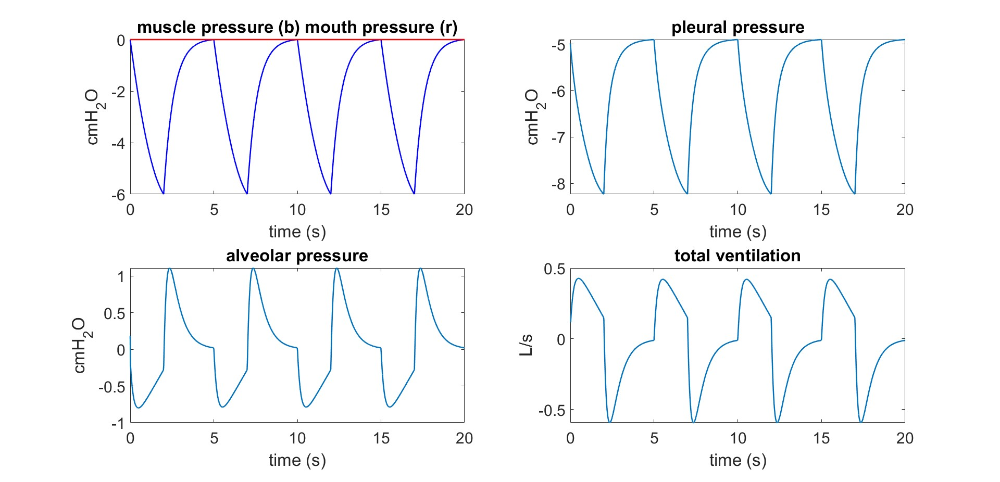
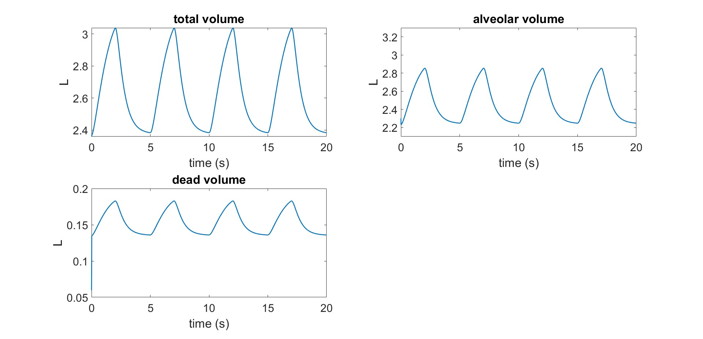
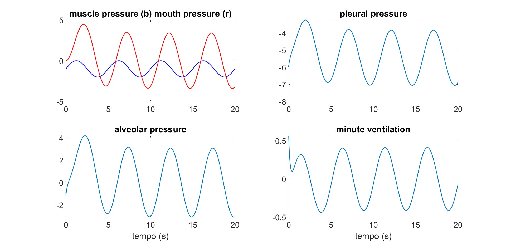
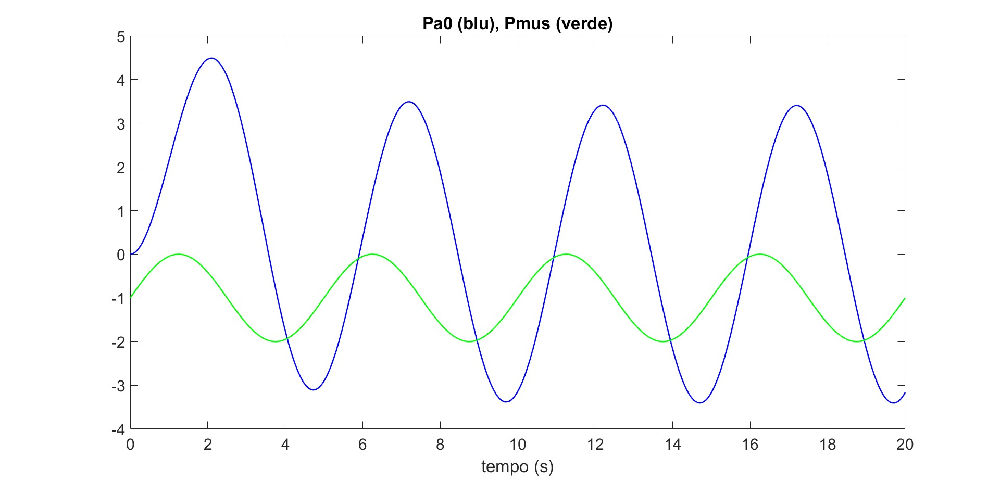
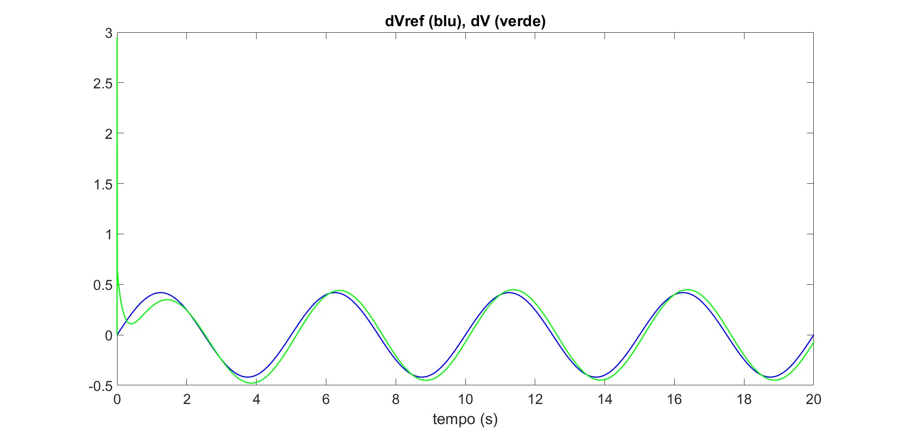
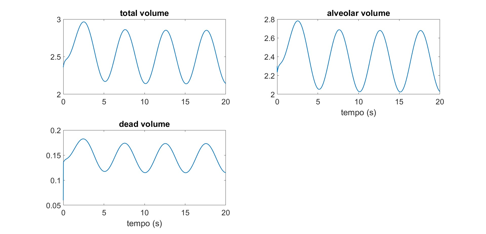

# Exercise 07 Report

## Title
Respiratory Mechanics With Natural Breathing and Assisted Flow-Tracking Control

## Executive Summary
This exercise compares two simulations of the same lumped respiratory mechanics model. The first case (`Exercise7.m`) represents natural breathing with a non-sinusoidal muscle pressure waveform and zero mouth pressure forcing. The second case (`Exercise7_II.m`) adds a control law that modulates mouth pressure to track a target ventilation waveform.

Both simulations produce stable periodic respiration. The controlled case shows improved flow tracking and larger alveolar pressure swings driven by the actuator, while volume oscillations remain physiologically coherent.

## Common Respiratory Model
The model uses compliances and resistances for upper airway, thoracic compartments, bronchial compartment, alveoli, and chest wall:

- Compliances: `Cl`, `Ct`, `Cb`, `CA`, `Ccw`
- Resistances: `Rml`, `Rlt`, `Rtb`, `RbA`
- Unstressed volumes: `Vul`, `Vut`, `Vub`, `VuA`

Derived pressures and flows:

- `Ppl = P5 + Pmus`
- `PA = P4 + Ppl`
- `dV = (Pa0 - Pl)/Rml` (mouth-to-lung flow)
- `dVA = (Pb - PA)/RbA` (alveolar flow)

Volumes:

- `Vl = Cl*Pl + Vul`
- `Vt = Ct*(Pt - Ppl) + Vut`
- `Vb = Cb*(Pb - Ppl) + Vub`
- `VA = CA*(PA - Ppl) + VuA`
- `VD = Vl + Vt + Vb`
- `Vtot = VA + VD`

Integration is performed with Euler method.

## Scenario A: Natural Breathing (`Exercise7.m`)

### Setup
- Simulation duration: `20 s`
- Time step: `dt = 0.0002 s`
- Breathing period: `T = 5 s` (`12 breaths/min`)
- `Pa0 = 0` (no external mouth pressure forcing)
- Muscle pressure uses an asymmetric physiological waveform (inspiratory phase + exponential expiratory relaxation)

### Results
#### Pressures and ventilation

- Muscle pressure ranges approximately from `0` to `-6 cmH2O`.
- Pleural pressure remains negative and oscillatory (about `-8` to `-5 cmH2O`).
- Alveolar pressure oscillates around zero with moderate amplitude.
- Ventilation flow shows a periodic inspiratory/expiratory pattern with slight asymmetry, matching the non-sinusoidal drive.

#### Volumes

- Total volume oscillates approximately between `2.4` and `3.0 L`.
- Alveolar volume oscillates approximately between `2.25` and `2.85 L`.
- Dead-space volume oscillates with smaller amplitude around `0.13-0.18 L`.

The system reaches a stable periodic regime after a short transient.

## Scenario B: Controlled/Assisted Breathing (`Exercise7_II.m`)

### Setup
- Simulation duration: `20 s`
- Time step: `dt = 0.0001 s`
- Breathing period: `T = 5 s`
- Muscle pressure: sinusoidal with phase shift (`fi = 0.75*2*pi`)
- Target ventilation waveform: `dVref = Vent_ref*pi/60*sin(2*pi*t/T)` with `Vent_ref = 8 L/min`
- Mouth pressure control law:
  - `dPa0 = (-Pa0 + kcontrol*(dVref - dV))/tauv`
  - `kcontrol = 22`, `tauv = 2 s`

### Results
#### Pressures and minute ventilation

Compared with the natural case, alveolar pressure oscillations are larger, reflecting active assistance through mouth pressure modulation.

#### Mouth pressure vs muscle pressure

`Pa0` develops a larger amplitude than `Pmus`, indicating actuator contribution to respiratory drive.

#### Flow tracking quality

`dV` (green) follows `dVref` (blue) closely after an initial transient, with small residual phase/amplitude error.

#### Volumes

Volume trajectories remain periodic and stable. Alveolar and total volume oscillations are comparable in magnitude to the natural case, with shape changes consistent with controller action.

## Discussion
Exercise 07 shows how the same mechanical lung model behaves under two different drive strategies. Natural breathing produces a physiologically shaped, self-driven flow profile. Adding control at the mouth pressure level allows explicit tracking of a desired ventilation pattern.

The tracking plot confirms that the closed-loop term `kcontrol*(dVref - dV)` effectively reduces error after startup. At the same time, the model preserves coherent pressure-volume relationships, which suggests that the controller is strong enough to shape flow but not so aggressive that it destabilizes the mechanical dynamics.

Overall, the results are consistent with assisted ventilation intuition: controlled airway pressure can support/steer ventilation while intrinsic muscle dynamics remain present.

## Conclusion
Exercise 07 successfully compares spontaneous and assisted respiratory dynamics in the same compartmental model.

Main outcomes:

1. Natural breathing case yields stable periodic pressure, flow, and volume dynamics at `12 breaths/min`.
2. Controlled case achieves close tracking of reference ventilation flow via dynamic mouth pressure control.
3. Both simulations remain dynamically stable and physiologically interpretable.

This provides a useful base for future controller tuning studies (for example varying `kcontrol`, `tauv`, phase shift, or target ventilation profiles).
